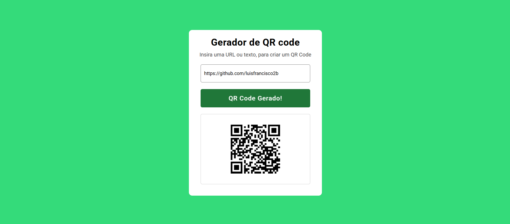

# 🎯 QR Code Generator

A modern, responsive, and elegant web application for instant QR Code generation, featuring real-time API integration, dynamic visual states, and clean user experience handling.

---

## 📸 Preview

<p align="center">
  
  
</p>

## 🚀 Technologies Used

- **HTML5:** Semantic structuring of the application layout, utilizing input fields, action buttons, and responsive wrapper containers.
- **CSS3:** Modern styling utilizing fluid transitions, custom Google Fonts, structural Flexbox alignment, and responsive media queries for cross-device compatibility.
- **JavaScript (ES6+):** Pure DOM manipulation and asynchronous event-driven programming implementing:
  - Asynchronous image loading synchronization (`load` event) to ensure seamless UI state transitions.
  - Dynamic event listeners (`click`, `keydown`, `keyup`) handling form input and automatic cleanup.
  - Template literals for dynamic external REST API URL string construction.

---

## 🧠 Core Learnings & Implementation Concepts

The main objective of this project was to master external API integration, asynchronous resource handling, and reactive DOM state manipulation in vanilla JavaScript. Key architectural concepts mastered include:

1. **Asynchronous Image Loading (`load` Event):** Intercepting the image loading lifecycle (`qrCodeImg.addEventListener("load")`) to guarantee that the UI container expands (`.active` class toggle) only after the QR Code image has completely downloaded from the API, preventing broken layout rendering.

2. **Input Validation & Early Return Guard:** Implementing a secure execution guard (`if (!qrCodeInputValue) return;`) to instantly validate user input, preventing empty requests and optimizing application flow.

3. **Real-time Reactive Cleanup (`keyup` Event):** Monitoring user interactions on-the-fly to detect when the input field is fully cleared (`Back-space`/`Delete`), automatically resetting container visibility and button text states.

---

## 📦 How to Run the Project Locally

### 1. Clone this repository:

```bash
git clone https://github.com/luisfrancisco2b/qr-code-generator
```

### 2. Navigate to the project folder

```bash
cd qr-code-generator
```

### 3. 🚀 Running the Project

```bash
Since this is a front-end application, you can run it directly.

Open Open the `index.html` file in your browser, or run it using an extension like **Live Server** in VS Code:

http://127.0.0.1:5500/index.html
```

## 👨‍💻 Author

Luis Francisco